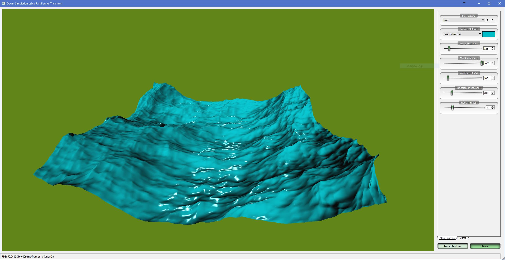
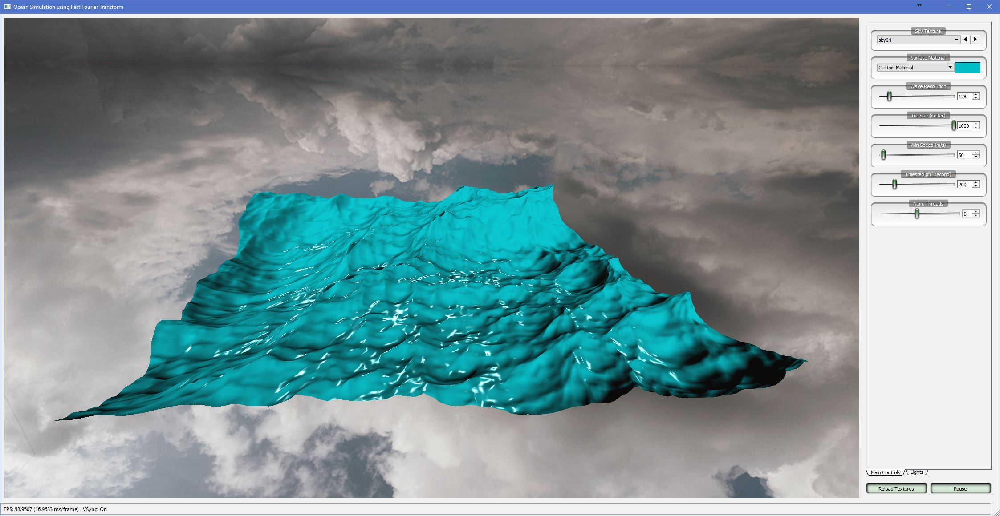
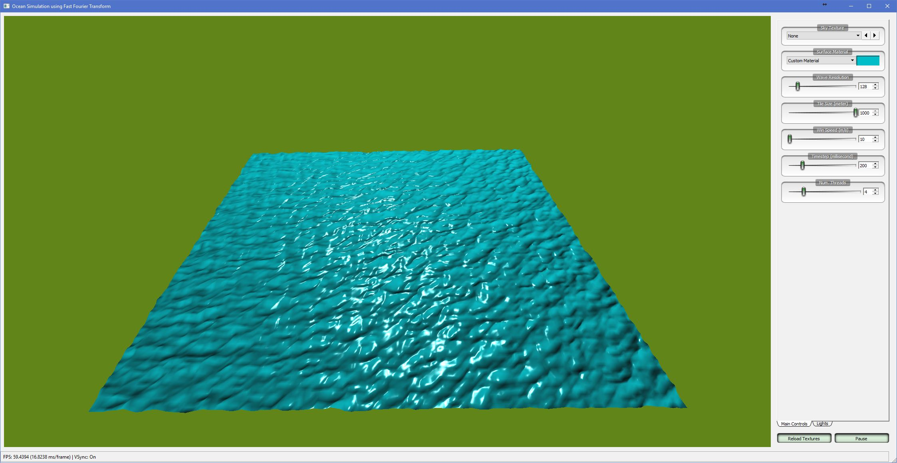
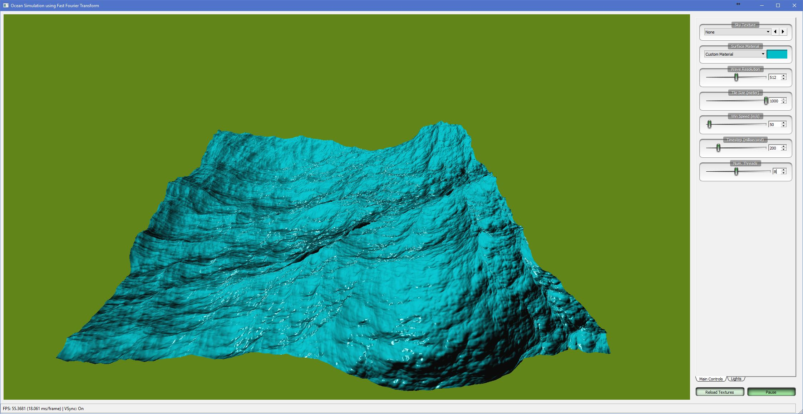

# Ocean Simulation using Fast Fourier Transform

* The program is implemented in Qt 5.9 framework.
* Multi-threading by Intel TBB and fftw3_threads libraries.
* Skybox textures in folder Textures/Sky are automatically loaded at start up.
* Press Spacebar key to pause/resume the simulation.
* Simulation parameters can be changed and take effects in real time.
* A binary (in Pre-Build folder) has been provided.
* As my implementation depends on a lots of external libaries, the source code can only be compiled by me.

---

# Screenshots:

